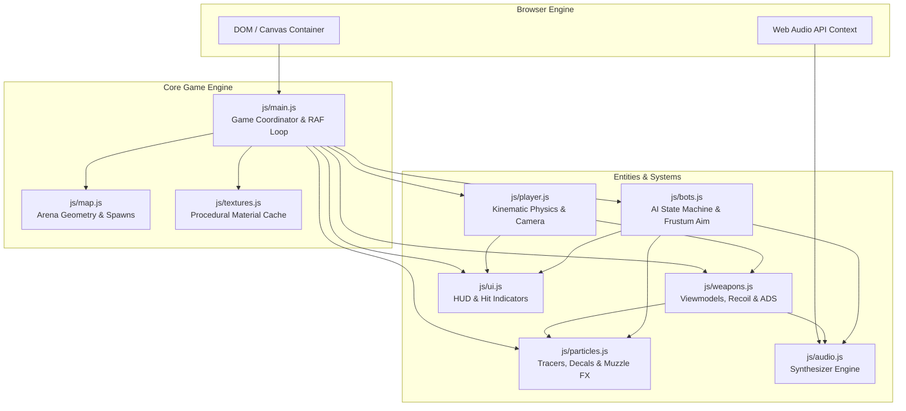

# 🏛️ Krunker Arena System Architecture

> **Document Scope**: High-level overview of the game engine's software architecture, component relationships, state machines, and lifecycle execution graph.

---

## 1. High-Level System Architecture Diagram



---

## 2. Match Lifecycle & State Machine

```mermaid
stateDiagram-v2
    [*] --> LOBBY : Page Load

    state LOBBY {
        [*] --> MenuDisplay
        MenuDisplay --> CameraOrbit : Background 3D View
        note right of LOBBY
            isGameStarted = false
            Player immune to damage
            Bots ignore player
        end note
    }

    LOBBY --> ACTIVE_MATCH : Click "START" or "QUICK MATCH"

    state ACTIVE_MATCH {
        [*] --> SpawnPlayer
        SpawnPlayer --> CombatLoop
        CombatLoop --> Death : HP <= 0
        Death --> RespawnTimer : 3.0s Delay
        RespawnTimer --> SpawnPlayer : Invulnerability Shield (2.5s)
    }

    ACTIVE_MATCH --> MATCH_OVER : Timer Reaches 0:00
    MATCH_OVER --> LOBBY : Dismiss Leaderboard
```

---

## 3. Module Responsibilities

| Module | Primary Responsibility | Dependencies |
|---|---|---|
| [`index.html`](../index.html) | Root document, WebGL viewport, HUD layout containers, crosshair elements. | CSS, Three.js |
| [`css/style.css`](../css/style.css) | HUD cyber-styling, responsive positioning, tactical bulging damage indicators. | None |
| [`js/main.js`](../js/main.js) | Three.js scene creation, camera setup, lighting, requestAnimationFrame coordinator. | Three.js, all game modules |
| [`js/player.js`](../js/player.js) | Input capture (WASD/Mouse/PointerLock), slide-hopping, AABB collision, health. | Three.js, Weapons, Audio, UI |
| [`js/weapons.js`](../js/weapons.js) | 4 weapon classes (AR, Sniper, SMG, Revolver), viewmodel generation, recoil spring. | Three.js, Audio, Particles, UI |
| [`js/bots.js`](../js/bots.js) | Enemy bot spawning, waypoint patrol, frustum FOV cone calculation, strafe weaving. | Three.js, Map, Audio, Particles |
| [`js/map.js`](../js/map.js) | Voxel arena layout (`Undergrowth`), cover boxes, ramp geometry, spawn anchors. | Three.js, Textures |
| [`js/textures.js`](../js/textures.js) | Procedural Canvas 2D texture generation (brick, wood, metal, skin), material cache. | Three.js |
| [`js/particles.js`](../js/particles.js) | Bullet tracers, muzzle flash sprites, voxel blood particles, bullet impact decals. | Three.js |
| [`js/audio.js`](../js/audio.js) | 100% procedural Web Audio API sound synthesis (gunshots, hits, reload, slide). | Web Audio API |
| [`js/ui.js`](../js/ui.js) | Tactical bulging damage indicator, scoreboard, health bar, killfeed, damage text. | DOM |

---

## 4. Tick Sequence per Render Frame

Every frame executed by `requestAnimationFrame(animate)` follows this deterministic order:
1. **Delta Time Calculation**: Clamped to a maximum of $0.1\text{s}$ to prevent physics tunneling during tab switches.
2. **Player Physics Update**: Inputs are polled, friction applied, slide impulses integrated, AABB collisions resolved.
3. **Weapon Viewmodel & ADS Lerp**: Camera-relative viewmodel coordinates interpolated; recoil spring updated.
4. **Bot AI Update**: Bots evaluate player distance, perform frustum cone check, update strafe vectors, and fire if aligned.
5. **Particle Pool Update**: Active tracers and blood particles stepped and recycled.
6. **HUD / UI Synchronization**: Dirty-flagged DOM elements refreshed.
7. **WebGL Render**: `renderer.render(scene, camera)` draws the final frame.
