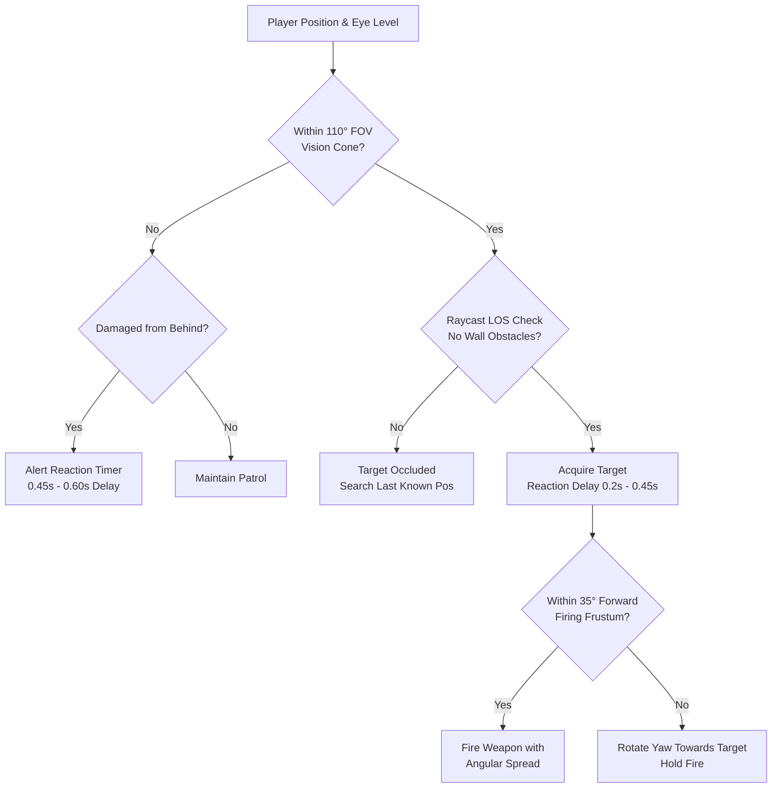
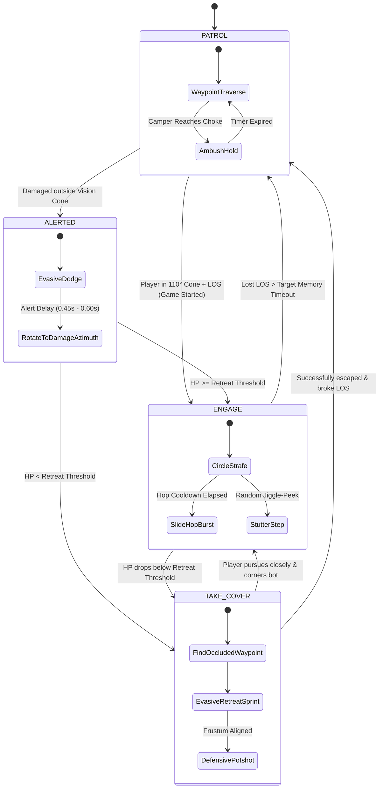

# 🧠 FPS Striker Bot AI Architecture & Combat Steering Guide

> **Document Scope**: Theoretical foundations, industry best practices, sensory perception pipelines, finite state machines (FSM), Craig Reynolds steering behaviors, and diverse bot combat archetypes in **FPS Striker**.

---

## 📑 Table of Contents
1. [Theoretical Foundations & Industry Best Practices](#1-theoretical-foundations--industry-best-practices)
   - [Quake III Arena & "Mr. Elusive" Architecture](#quake-iii-arena--mr-elusive-architecture)
   - [Unreal Tournament & Hierarchical Task Networks](#unreal-tournament--hierarchical-task-networks)
   - [Craig Reynolds Steering Behaviors](#craig-reynolds-steering-behaviors)
   - [Tactical Shooters: F.E.A.R. (GOAP) & Halo (Behavior Trees)](#tactical-shooters-fear-goap--halo-behavior-trees)
2. [Sensory Perception Pipeline in FPS Striker](#2-sensory-perception-pipeline-in-fps-striker)
   - [Dual-Stage Vision & Frustum Cone Calculations](#dual-stage-vision--frustum-cone-calculations)
   - [Raycast Line-of-Sight (LOS) Occlusion](#raycast-line-of-sight-los-occlusion)
   - [Auditory & Backstab Flank Alert Delay](#auditory--backstab-flank-alert-delay)
   - [Lobby Match Lifecycle Immunity Gate](#lobby-match-lifecycle-immunity-gate)
3. [Combat Archetypes & Personality Matrix](#3-combat-archetypes--personality-matrix)
   - [Hunter (Aggressive Rusher)](#archetype-1-hunter-aggressive-rusher)
   - [Flanker (High-Speed Skirmisher)](#archetype-2-flanker-high-speed-skirmisher)
   - [Patroller (Casual Wanderer)](#archetype-3-patroller-casual-wanderer)
   - [Camper (Ambush / Tactical Anchor)](#archetype-4-camper-ambush--tactical-anchor)
   - [Survivor (Tactical Retreater)](#archetype-5-survivor-tactical-retreater)
4. [Finite State Machine (FSM) Lifecycle](#4-finite-state-machine-fsm-lifecycle)
5. [Steering Kinematics & Obstacle Avoidance](#5-steering-kinematics--obstacle-avoidance)
   - [3-Feeler Whisker Probing](#3-feeler-whisker-probing)
   - [Continuous Axis Wall-Sliding](#continuous-axis-wall-sliding)
   - [Slide-Hop 3D Kinematics & Dodge Bursts](#slide-hop-3d-kinematics--dodge-bursts)
   - [Anti-Stuck Deadlock Watchdog](#anti-stuck-deadlock-watchdog)
6. [Zero-GC Performance Guardrails](#6-zero-gc-performance-guardrails)

---

## 1. Theoretical Foundations & Industry Best Practices

### Quake III Arena & "Mr. Elusive" Architecture
In 1999, Jean-Paul van Waveren ("Mr. Elusive") authored the AI system for id Software's *Quake III Arena*, establishing the gold standard for high-speed 3D arena shooter bots:
- **Area Awareness System (AAS)**: Precomputed spatial reachability graphs dividing 3D BSP volumes into convex hulls with reachability links (walk, jump, rocket-jump, teleporter).
- **Fuzzy Logic Desirability Scoring**: Bots evaluate non-binary utility curves for weapon pickup values, health urgency, armor importance, and target threat level.
- **Micro-Level Combat Kinematics**: Circle-strafing, randomized strafe-jumping, leading projectile trajectories with Gaussian aim spread, and human-like angular damping.

### Unreal Tournament & Hierarchical Task Networks
Authored by Steve Polge for Epic Games, the *Unreal Tournament* bot architecture pioneered:
- **AIController Separation**: Strict detachment between decision-making (`AIController`) and physical world embodiment (`Pawn`), enabling independent weapon/movement handling.
- **Hierarchical Task Networks (HTN) & Event-Driven Reflexes**: High-level strategic directives (defend base, capture flag, ambush corridor) combined with low-level event subscriptions (player spotted, incoming projectile, damage registered) for instantaneous micro-dodging.

### Craig Reynolds Steering Behaviors
In his seminal 1987 and 1999 papers (*"Flocks, Herds, and Schools: A Distributed Behavioral Model"* and *"Steering Behaviors For Autonomous Characters"*), Craig Reynolds introduced the 3-tier kinematic hierarchy:
```
┌──────────────────────────────────────────────┐
│  1. Action Selection (Strategic / FSM / BT) │
├──────────────────────────────────────────────┤
│  2. Steering Behaviors (Force Vector Math)   │
├──────────────────────────────────────────────┤
│  3. Locomotion (Physics Engine Integration)  │
└──────────────────────────────────────────────┘
```
The steering force vector $\vec{F}_{\text{steer}}$ is computed as:
$$\vec{F}_{\text{steer}} = \vec{v}_{\text{desired}} - \vec{v}_{\text{current}}$$
Key steering behaviors implemented in FPS Striker:
1. **Seek & Pursue**: Orienting velocity toward the player's current position (Seek) or extrapolated forward position (Pursue).
2. **Flee & Evade**: Orienting velocity directly away from an approaching threat or weapon tracer vector.
3. **Lateral Orbit / Strafe**: Generating an orthogonal tangential velocity vector $\vec{v}_{\perp} = (-d_z, 0, d_x)$ to circle-strafe while maintaining line-of-sight.
4. **Feeler Whisker Obstacle Avoidance**: Ray-probing forward bounding hulls to steer tangential to obstacles before physical collisions occur.

### Tactical Shooters: F.E.A.R. (GOAP) & Halo (Behavior Trees)
- **F.E.A.R. (Jeff Orkin, Monolith)**: Goal-Oriented Action Planning (GOAP) utilized dynamic A* planning through an action-precondition space, creating the illusion of emergent coordination (flanking, ducking under tables, blind-firing).
- **Halo 2 (Damian Isla, Bungie)**: Behavior Trees (BTs) structured reactive behavior hierarchies into Selector, Sequence, and Decorator nodes, introducing specialized combat roles (Elites as aggressive hunters, Grunts as panic retreaters, Jackals as stationary snipers).

---

## 2. Sensory Perception Pipeline in FPS Striker

FPS Striker simulates realistic human visual and auditory perception, strictly forbidding omniscience or "wall-hacking".



### Dual-Stage Vision & Frustum Cone Calculations
Bots distinguish between **peripheral target spotting** and **strict weapon firing alignment**:

1. **Broad Peripheral Spotting Cone ($110^\circ$ FOV)**:
   - Used for initial target acquisition during `PATROL`.
   - Calculated via the 2D dot product of the bot's planar facing vector $\vec{f} = (\sin\theta_y, \cos\theta_y)$ and the normalized target direction $\vec{d}$:
   $$\cos\alpha = \vec{f} \cdot \vec{d} = f_x d_x + f_z d_z$$
   - Condition: $\alpha \le 55^\circ \implies \cos\alpha \ge 0.57$.

2. **Strict Weapon Firing Frustum Cone ($35^\circ$ FOV)**:
   - Enforced in `isPlayerInFrustumCone(playerPos)`.
   - Bots can **NEVER** discharge bullets if facing away or misaligned:
   $$\alpha \le 0.60\,\text{rad} \approx 34.37^\circ \implies \cos\alpha \ge 0.82$$
   - If misaligned, the bot holds fire and smoothly interpolates its yaw until centered on target.

### Raycast Line-of-Sight (LOS) Occlusion
- Raycasts are performed from bot eye height ($y + 1.76$) to player eye height ($y_{\text{cam}}$).
- Raycast testing is strictly bounded between $0.2\text{m}$ and $\text{dist} - 0.2\text{m}$ against the pre-filtered `map.shootableMeshes` array.
- Zero allocations in the render loop: pre-allocated `_losDir` and `_losRay` are reused across all bots.

### Auditory & Backstab Flank Alert Delay
- If shot from behind or outside the $110^\circ$ vision cone, bots **never snap 180° instantly**.
- Instead, the bot enters an `isAlerted` state with a realistic reaction delay ($\tau \in [0.45, 0.60]\,\text{s}$).
- During this window, the bot triggers an immediate evasive dodge/slide-hop before turning toward the incoming damage azimuth.

### Lobby Match Lifecycle Immunity Gate
- Bots strictly respect `window.game.isGameStarted`.
- Before the match countdown concludes, bots remain locked in `PATROL` mode, ignoring the player completely and discarding all combat target acquisitions.

---

## 3. Combat Archetypes & Personality Matrix

Rather than uniform identical bots, FPS Striker assigns distinct psychological and kinematic archetypes across bot instances:

| Archetype | Primary Role | Base Speed | Strafe Speed | Preferred Range | Reaction Time | Retreat HP | Slide-Hop P(Jump) | Special Maneuver |
|---|---|---|---|---|---|---|---|---|
| **HUNTER** | Aggressive Rusher | 8.2 m/s | 5.2 m/s | 6 – 12 m | 0.26 s | < 25 HP | 75% | Relentless forward push, slide-hop gap closing |
| **FLANKER** | Skirmisher / Circler | 7.6 m/s | 6.0 m/s | 12 – 18 m | 0.32 s | < 35 HP | 60% | High-speed lateral orbit, rapid jiggle-peeking |
| **PATROLLER** | Casual Wanderer | 6.8 m/s | 4.2 m/s | 10 – 20 m | 0.44 s | < 30 HP | 35% | Relaxed patrol weave, reacts only when challenged |
| **CAMPER** | Ambush Anchor | 6.5 m/s | 3.8 m/s | 14 – 24 m | 0.35 s | < 40 HP | 25% | Holds corner ambush, crouch-precision burst fire |
| **SURVIVOR** | Tactical Retreater | 7.8 m/s | 4.8 m/s | 15 – 26 m | 0.30 s | < 50 HP | 80% | Early evasive retreat, breaks LOS zig-zagging |

---

### Archetype 1: Hunter (Aggressive Rusher)
- **Tactical Doctrine**: Close distance rapidly to overwhelm the player in close quarters.
- **Behavior**:
  - Pushes forward with high positive forward bias whenever player distance $> 10\text{m}$.
  - Rapid attack cadence and high slide-hop momentum usage ($P = 0.75$).
  - When the player retreats behind cover, the Hunter pursues the last known location for up to $2.2\text{s}$ before returning to patrol.

### Archetype 2: Flanker (High-Speed Skirmisher)
- **Tactical Doctrine**: Circle around the player's flank while avoiding frontal confrontations.
- **Behavior**:
  - Prioritizes lateral perpendicular velocity $\vec{v}_{\perp}$ over forward approach.
  - Highly unpredictable strafe rhythm with frequent direction flips ($0.2\text{s} - 0.5\text{s}$) and stutter-step stops.
  - Maintains an optimal mid-range engagement envelope ($12\text{m} - 18\text{m}$).

### Archetype 3: Patroller (Casual Wanderer)
- **Tactical Doctrine**: Arena background presence, maintaining authentic casual player behavior.
- **Behavior**:
  - Smooth, relaxed patrol waypoint navigation with wide sinusoidal strafe arcs (`strafeAmp` up to $3.6$).
  - Longer visual confirmation delay ($0.44\text{s}$) before locking target.
  - Normal combat cadence once engaged.

### Archetype 4: Camper (Ambush / Tactical Anchor)
- **Tactical Doctrine**: Anchor near cover waypoints, holding choke angles and ambushing passers-by.
- **Behavior**:
  - When reaching a suitable waypoint with cover, the Camper enters an `AMBUSH` state, holding position for $3.0\text{s} - 5.0\text{s}$ while scanning the corridor.
  - Reduced movement jitter during fire for tighter cone spread.
  - If flanked or damaged at close range, triggers an immediate defensive panic slide-hop and resets position.

### Archetype 5: Survivor (Tactical Retreater)
- **Tactical Doctrine**: High preservation priority, mirroring tactical survivability playstyles.
- **Behavior**:
  - High retreat threshold: enters `TAKE_COVER` as soon as HP drops below $50\%$.
  - Rapidly queries navigation waypoints to select the node maximizing distance from the player that breaks line-of-sight.
  - Executes evasive sinusoidal sprints combined with slide-hop jumps. Returns defensive potshots only when facing within the forward frustum.

---

## 4. Finite State Machine (FSM) Lifecycle



---

## 5. Steering Kinematics & Obstacle Avoidance

### 3-Feeler Whisker Probing
To prevent bots from getting trapped on corners or sliding endlessly against walls, the steering controller projects three forward whisker feelers:
1. **Center Feeler**: Cast $2.4\text{m}$ forward along current yaw $\theta_y$:
   $$\vec{P}_{\text{center}} = \vec{P} + 2.4 \begin{pmatrix} \sin\theta_y \\ 0 \\ \cos\theta_y \end{pmatrix}$$
2. **Left Feeler ($-40^\circ$)**: Cast $2.4\text{m}$ at $\theta_y - 0.70\,\text{rad}$.
3. **Right Feeler ($+40^\circ$)**: Cast $2.4\text{m}$ at $\theta_y + 0.70\,\text{rad}$.

**Steering Resolution**:
- If center is blocked and right is clear $\implies \Delta\theta_y = +0.8\,\text{rad}$ (steer right).
- If center is blocked and left is clear $\implies \Delta\theta_y = -0.8\,\text{rad}$ (steer left).
- If all three are blocked $\implies$ invoke `pickNextWaypoint()` to reverse or diverge.

### Continuous Axis Wall-Sliding
Movement integration decomposes the intended velocity $(\Delta x, \Delta z)$ into decoupled axes:
```javascript
// Axis X check
_nextX.set(this.position.x + stepX, this.position.y, this.position.z);
if (!this.map.checkCollision(_nextX, this.radius, this.height)) {
    this.position.x += stepX;
} else {
    this.velocity.x = 0; // Slide along Z
}

// Axis Z check
_nextZ.set(this.position.x, this.position.y, this.position.z + stepZ);
if (!this.map.checkCollision(_nextZ, this.radius, this.height)) {
    this.position.z += stepZ;
} else {
    this.velocity.z = 0; // Slide along X
}
```

### Slide-Hop 3D Kinematics & Dodge Bursts
Bots reproduce authentic player slide-hopping:
- **Momentum Boost**: Velocity scaled by $\times 1.25$ during the hop phase ($0.55\text{s}$).
- **Parabolic Vertical Arc**:
  $$y_{\text{offset}} = 0.35 \sin(\pi \cdot p_{\text{hop}})$$
- **Evasive Trigger**: Taking bullet damage immediately reverses strafe direction and triggers a $55\%$ probability reactive slide-hop with $+3.3\text{m/s}$ lateral impulse.

### Anti-Stuck Deadlock Watchdog
A hardware watchdog tracks bot spatial displacement over a sliding $1.0\text{s}$ interval:
$$\|\vec{P}(t) - \vec{P}(t - 1.0\text{s})\| < 0.40\,\text{m}$$
If detected, the bot breaks the deadlock by picking a new waypoint and applying a strong impulse pointing directly toward the open arena center.

---

## 6. Zero-GC Performance Guardrails

To sustain $\ge 100\,\text{FPS}$ with zero Garbage Collection pauses, all bot calculations follow these strict rules:
1. **Module-Scope Pre-Allocated Scratch Objects**:
   - `_v1`, `_v2`, `_botEyePos`, `_playerEyePos`, `_probeCenter`, `_probeLeft`, `_probeRight`, `_nextX`, `_nextZ`, `_aimDir`, `_tracerEnd`, `_playerCenter`, `_toPlayer`, `_closestPoint`, `_centerDir`, `_losDir`, `_losRay`.
2. **Zero `new` Calls in `update()`**: No vector, matrix, or array allocations during frame ticks.
3. **Dirty-Flagged Overhead UI Updates**: Canvas 2D nameplate redraws only trigger on health changes or spawn.
4. **Distance & Frustum Culling (LOD)**:
   - Nameplate sprites hidden beyond $48\text{m}$ or outside camera frustum.
   - Limb skeletal walk animations culled when out of camera frustum and $> 20\text{m}$.
