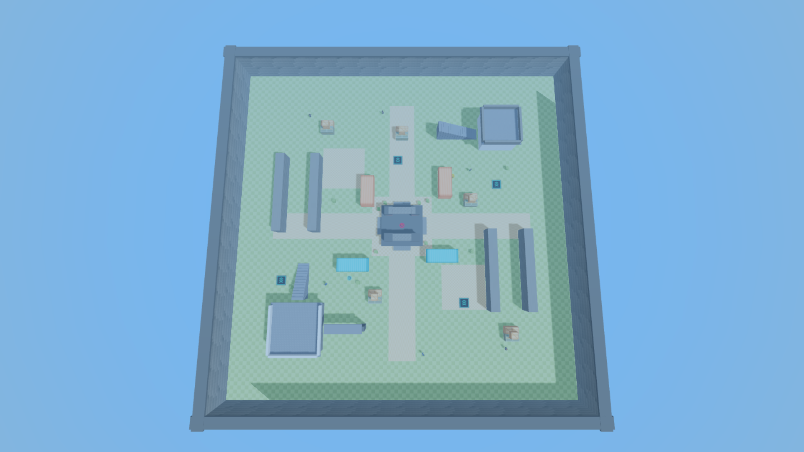
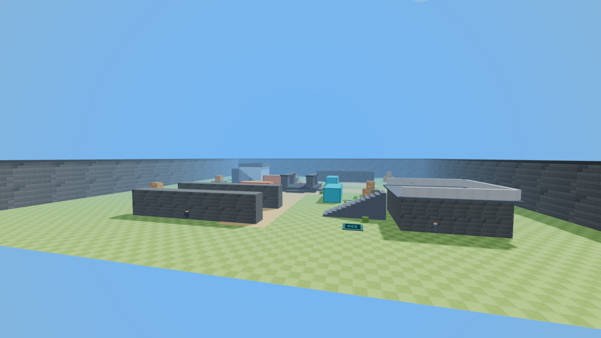
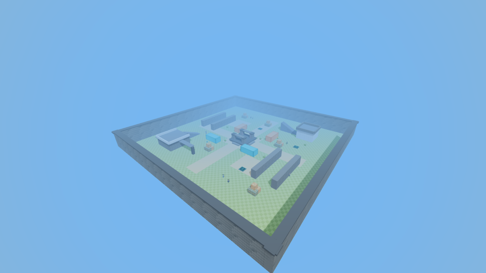

# Outpost Arena // Architectural Specification & Map Geometry Reference

This document provides architectural schematics, elevation data, coordinate breakdowns, and high-resolution visual reference renders for the current **Outpost Arena** map (`js/map.js`) in FPS Striker.

---

## 📸 Architectural Visualizations

### 1. Plan View (Top-Down Zenith)
High-clarity orthographic top-down render showing perimeter bounds, arterial lanes, central fortress, elevated structures, shipping containers, and jump pads.

### 2. Side Elevation View (Profile Cross-Section)
Side elevation cross-section highlighting interior verticality, staircase riser profiles, catwalk overlooks, elevated fortress levels, and perimeter wall heights.

### 3. Isometric / 3D Perspective View
High-angle diagonal perspective capturing the full arena volume, lighting, cover density, and spatial flow across all four quadrants.

---

## 📐 Dimensional & Coordinate Breakdown

| Feature / Structure | World Position $(X, Y, Z)$ | Dimensions $(W \times H \times D)$ | Material / Texture | Tactical Function |
|---|---|---|---|---|
| **Arena Ground Base** | $(0, 0, 0)$ | $160\text{m} \times 0\text{m} \times 160\text{m}$ | Voxel Olive Grass | Main combat floor |
| **Perimeter Boundary Walls** | Outer edges ($X, Z = \pm 78$) | $160\text{m} \times 14\text{m} \times 4\text{m}$ | Stone Masonry + Dark Trim | Arena containment |
| **Central Ruined Fortress Dais** | $(0, 0.9, 0)$ | $18\text{m} \times 1.8\text{m} \times 18\text{m}$ | Stone Brick + Dark Trim | Primary king-of-the-hill contention zone |
| **Central Dais Pillars** | $(\pm 6, 4.5, \pm 6)$ | $3.2\text{m} \times 5.0\text{m} \times 3.2\text{m}$ | Stone Pillar (Cap $7.2\text{m}$) | Hard cover on central platform |
| **North-East Sniper Tower** | $(45, 4.5, -45)$ | $16\text{m} \times 9.0\text{m} \times 16\text{m}$ (Top $10.5\text{m}$) | Concrete + Diamond Plate | Long-range vantage point with parapet |
| **NE Tower Ramp** | $X: 35.5 \to 17.5, Z: -45$ | 16 steps ($0.55\text{m}$ rise / $1.2\text{m}$ run) | Diamond Plate Tread | Step-climbing access to NE sniper roost |
| **South-West Elevated Fort** | $(-45, 3.5, 45)$ | $20\text{m} \times 7.0\text{m} \times 20\text{m}$ (Top $8.5\text{m}$) | Sand Brick + Concrete Rim | Secondary elevated stronghold |
| **SW Fort Ramp** | $X: -45, Z: 18.0 \to 32.4$ | 13 steps ($0.52\text{m}$ rise / $1.2\text{m}$ run) | Diamond Plate Tread | Step-climbing access to SW fort |
| **SW Skybridge Overlook** | $(-25, 7.2, 45)$ | $16\text{m} \times 0.4\text{m} \times 4\text{m}$ | Diamond Plate + Pillar | Mid-air catwalk over south lane |
| **Orange Shipping Containers** | $(-16, 2.5, -16), (20, 2.5, -20)$ | $6\text{m} \times 5.0\text{m} \times 14\text{m}$ | Orange Corrugated Steel | Choke-point breakers & vaultable cover |
| **Teal Shipping Containers** | $(18, 2.5, 14), (-22, 2.5, 18)$ | $14\text{m} \times 5.0\text{m} \times 6\text{m}$ | Teal Corrugated Steel | Mid-lane line-of-sight obstruction |
| **Courtyard Alley Walls** | $(\pm 40, 3.5, \pm 15/20)$ | $4\text{m} \times 7.0\text{m} \times 36\text{m}$ | Sand Brick | Flanking lanes & close-quarters corridors |

---

## 🚀 Jump Pad Network

| Jump Pad ID | Location $(X, Y, Z)$ | Boost Force ($V_y$) | Target Trajectory |
|---|---|---|---|
| **Pad 1 (North Courtyard)** | $(-2, 0.1, -32)$ | $+16\text{ m/s}$ | Launches player toward Central Dais roof |
| **Pad 2 (South-East Courtyard)** | $(28, 0.1, 35)$ | $+18\text{ m/s}$ | Vaults player directly onto East Catwalk / Crate Rooftops |
| **Pad 3 (South-West Base)** | $(-55, 0.1, 25)$ | $+16\text{ m/s}$ | Quick launch onto SW Elevated Fort without using stairs |
| **Pad 4 (North-East Base)** | $(45, 0.1, -20)$ | $+18\text{ m/s}$ | High-speed vertical boost into NE Sniper Tower platform |

---

## 🎯 Spawn Distribution & Quadrant Balance

The 10 player/bot spawn points are radially distributed to prevent immediate spawn-camping and guarantee fair line-of-sight engagement angles:

- **Quadrant 1 (North-West)**: `(-55, 0.5, -55)`
- **Quadrant 2 (South-East)**: `(55, 0.5, 55)`
- **Quadrant 3 (South-West)**: `(-55, 0.5, 55)`
- **Quadrant 4 (North-East)**: `(55, 0.5, -55)`
- **South Arterial Anchor**: `(0, 0.5, 60)`
- **North Arterial Anchor**: `(0, 0.5, -60)`
- **West Courtyard Anchor**: `(-60, 0.5, 0)`
- **East Courtyard Anchor**: `(60, 0.5, 0)`
- **North-East Mid-Lane**: `(25, 0.5, -30)`
- **South-West Mid-Lane**: `(-25, 0.5, 30)`

---

## 💡 Level Design Recommendations for Next Iteration

1. **Catwalk Expansion**: Connect the SW Fort Skybridge to the Central Dais via a high-altitude zip/walkway to reward aggressive slide-hoppers.
2. **Underground Sub-Level / Tunnel**: Introduce a sub-surface subterranean trench beneath the central dais for stealth shotgun flanking.
3. **Destructible Voxel Cover**: Add low-durability wooden barricades across the narrow courtyard alleys that break upon taking bullet impacts.
